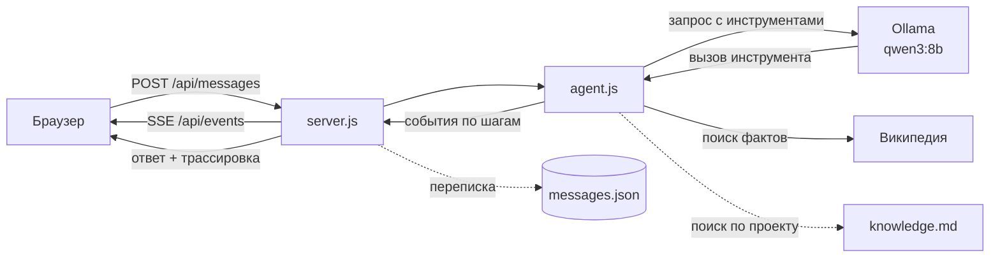

# Полигон ИИ-агентов

Учебный чат с локальной языковой моделью. В браузере — переписка, справа — панель, показывающая, что модель делает прямо сейчас. Отвечает не «голая» модель, а агент: он ищет факты инструментами, проверяет собственный ответ и переделывает его, если нарушил правила.

Всё работает на вашем компьютере. Единственный внешний сервис — Википедия, к которой агент ходит за фактами.

## Что умеет

- **Отвечает по источникам, а не по памяти.** База знаний проекта и поиск в Википедии.
- **Не выдумывает ссылки.** Ссылка в ответе сверяется с тем, что реально вернул инструмент.
- **Честно говорит «не знаю»**, когда поиск ничего не дал.
- **Считает и смотрит на часы инструментами**, а не в уме.
- **Показывает весь процесс**: живая панель во время ответа и раскрывающаяся трассировка под каждым сообщением.
- **Хранит переписку** в обычном JSON-файле, вместе с трассировкой каждого ответа.


## Быстрый старт

Нужны [Node.js](https://nodejs.org) 18 или новее (проверено на 24) и [Ollama](https://ollama.com) с моделью:

```bash
ollama pull qwen3:8b
```

Запуск сервера:

```bash
node server.js
```

Откройте http://localhost:3000. Зависимостей нет, `npm install` не нужен.

Проверочные вопросы: `Кто такой Линус Торвальдс?`, `Сколько будет 17*23+5?`, `Который сейчас час?`, `На каком порту работает сервер проекта?`

## Состав проекта

| Файл | Назначение |
|---|---|
| [`server.js`](server.js) | HTTP-сервер: статика, API переписки, поток событий |
| [`agent.js`](agent.js) | Мозг агента: инструменты, цикл, проверки ответа |
| [`knowledge.md`](knowledge.md) | База знаний о проекте, в которой ищет агент |
| [`index.html`](index.html) | Разметка: чат и панель монитора |
| [`script.js`](script.js) | Логика страницы: отправка, история, трассировка, монитор |
| [`styles.css`](styles.css) | Оформление |
| `messages.json` | Хранилище переписки, создаётся при первом сообщении |

## Как это работает



Модель не отвечает сразу: она сначала просит инструменты, сервер их выполняет и возвращает результаты, и так по кругу, пока не соберётся ответ. Каждый шаг отправляется в браузер и попадает в трассировку.

## Документация

| Раздел | О чём |
|---|---|
| [Архитектура](docs/architecture.md) | Из чего собран проект, путь вопроса, два канала связи |
| [Агент](docs/agent.md) | Промпт, инструменты, цикл, проверки, источники |
| [HTTP API](docs/api.md) | Маршруты, форматы запросов, события, структура данных |
| [Интерфейс](docs/frontend.md) | Разметка, скрипт страницы, стили |
| [Как расширять](docs/extending.md) | Новый инструмент, новая проверка, отладка, ограничения |

## Ограничения

Проект учебный. Он не рассчитан на публичный доступ: панель монитора общая для всех вкладок, переписка лежит в одном файле без разграничения прав, а часть правил держится на списках ключевых слов. Подробный разбор — в разделе [«Как расширять»](docs/extending.md#известные-ограничения).
