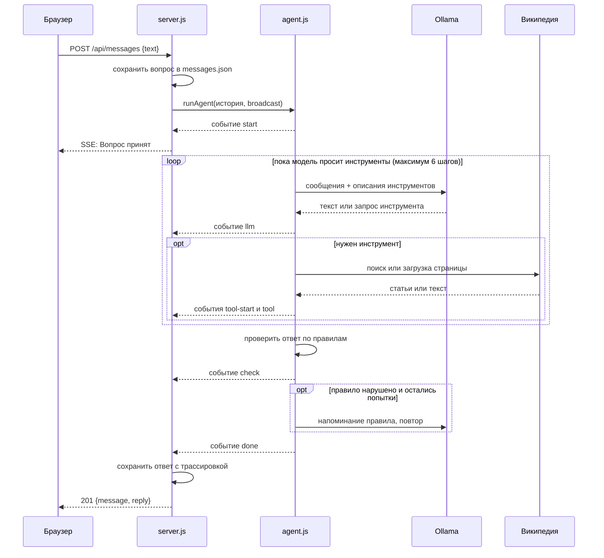

# Архитектура

## Три участника

| Участник | Где живёт | Отвечает за |
|---|---|---|
| Страница в браузере | `index.html`, `script.js`, `styles.css` | ввод, показ переписки, живая панель |
| HTTP-сервер | `server.js` | статика, хранение переписки, трансляция событий |
| Агент | `agent.js` | общение с моделью, инструменты, проверки |
| Модель | Ollama на `localhost:11434` | генерация текста и решение, какой инструмент вызвать |

Внешний мир — только Википедия, и только через инструменты агента.

Зависимостей нет намеренно: `http` и `fs` идут в составе Node.js, а `fetch` встроен начиная с 18-й версии. Поэтому проект запускается одной командой на чистой системе.

## Путь одного вопроса




## Два канала связи

Браузер общается с сервером двумя независимыми способами, и это главная идея устройства.

**Запрос-ответ.** `POST /api/messages` уходит и висит открытым всё время, пока агент работает: несколько секунд, иногда десятки. В ответ приходит готовое сообщение вместе с трассировкой. Этот канал даёт результат.

**Поток событий.** `GET /api/events` открывается один раз при загрузке страницы и не закрывается. По нему сервер шлёт короткие сообщения о каждом шаге агента, пока тот работает. Этот канал даёт ощущение происходящего.

Технически поток — это Server-Sent Events: обычный HTTP-ответ, который никогда не заканчивается. Браузер умеет его читать через встроенный `EventSource`, библиотек не нужно. Сервер держит открытые соединения в наборе `listeners` и при каждом событии пишет строку во все сразу:

```js
const listeners = new Set();

function broadcast(event) {
  const line = `data: ${JSON.stringify(event)}\n\n`;
  for (const client of listeners) client.write(line);
}
```

Отсюда следует важное свойство: **панель общая**. Все открытые вкладки видят одни и те же события, включая чужие вопросы.

Агент ничего не знает про HTTP. Он принимает функцию обратного вызова и просто сообщает о своих шагах; связывает их сервер, передавая `broadcast` внутрь `runAgent`.

## Хранение данных

Переписка лежит в `messages.json` рядом с сервером — обычный массив объектов. При каждом сохранении файл читается целиком, дополняется и записывается заново:

```js
function saveMessage(role, text, trace) {
  const message = { id: Date.now(), role, text, createdAt: new Date().toISOString() };
  if (trace) message.trace = trace;

  const messages = readMessages();
  messages.push(message);
  writeMessages(messages);
  return message;
}
```

Ответы агента хранятся вместе с трассировкой, поэтому «Показать процесс» работает и после перезагрузки страницы. Платой за это является размер файла: одна трассировка с результатами поиска весит больше самого ответа.

Файл внесён в `.gitignore` — переписка не должна попадать в репозиторий.

Модели передаётся не весь файл, а последние `HISTORY_LIMIT` сообщений (по умолчанию 20) и только их тексты, без трассировок.

## Безопасность по мелочам

- Наружу отдаются только четыре файла из списка `STATIC_FILES`; `server.js`, `agent.js` и `messages.json` недоступны по HTTP.
- Тело запроса обрывается после 100 КБ.
- Агенту запрещено открывать локальные и внутренние адреса, иначе страница из интернета могла бы отправить его на `localhost:11434` или в домашнюю сеть.

Подробности о защите агента — в разделе [«Агент»](agent.md#защита-от-подсказок-со-страниц).
